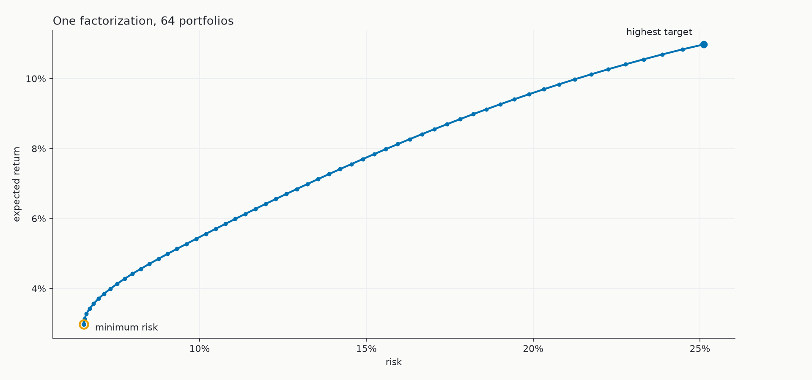
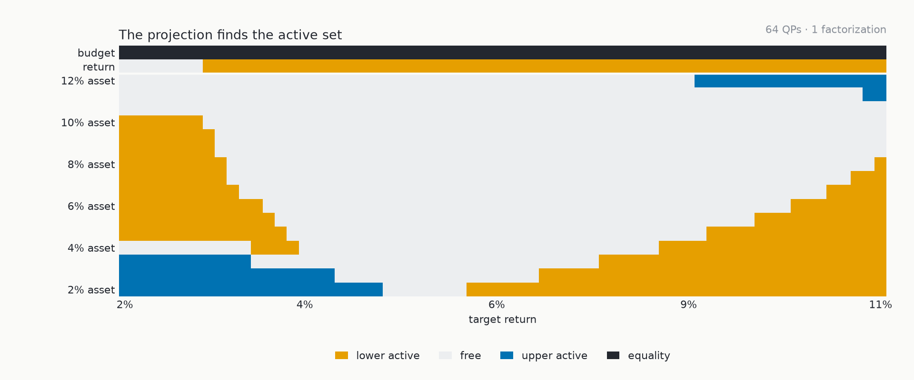

# splitQP

A tiny JAX solver for families of dense convex quadratic programs with fixed
quadratic and constraint matrices. It implements proximal ADMM: one Cholesky
factorization, performed when the `Solver` is constructed, serves every
iteration and every QP while the linear term and bounds vary.



*The 64 solutions above share $P$, $A$, and one Cholesky factor; only the
target-return bound changes between them.*

## Quick start

Python 3.12 and [uv](https://docs.astral.sh/uv/) are required. From the
repository root:

```bash
JAX_PLATFORMS=cpu uv run --group notebook jupyter execute --inplace portfolio.ipynb
```

This runs [`portfolio.ipynb`](portfolio.ipynb) top to bottom: it solves a
64-member Markowitz family, runs the validation checks, and prints:

```text
64 QPs, 1 factorization
max KKT residual: 2.00e-06
batch/scalar difference: 3.44e-15
cold iterations vs warm sequence: 48435 vs 36184
```

Opening the notebook shows the rest: a fresh-solve ADMM reference, an
exact-fraction first-step audit, and additional validation checks. The final
floating-point digits may vary across devices or separate XLA compilations.
On a compatible NVIDIA system, install the optional CUDA backend with
`uv sync --extra cuda`.

## Problem

splitQP accepts the box-constrained form

```math
\begin{aligned}
\min_x \quad & \frac{1}{2}x^\top P x + q^\top x \\
\text{subject to} \quad & l \leq A x \leq u.
\end{aligned}
```

where $P \succeq 0$. A problem family keeps $P$ and $A$ fixed while $q$, $l$,
and $u$ vary. Equalities, one-sided constraints, and two-sided constraints all
use the same projection onto $[l,u]$.



*At each fixed point, the box projection marks every constraint as lower
active, free, upper active, or equality. The 64 portfolios produce 24 distinct
non-budget patterns without changing the factorization.*

## Usage

```python
solver = splitqp.Solver(P, A)                   # the one factorization
result = solver.solve(q, l, u)                  # one QP
family = solver.solve_batch(qs, ls, us)         # B QPs sharing the factor
result, trace = solver.trace(q, l, u)           # named per-iteration record
warm = solver.solve(q2, l2, u2, init=result.state)
```

- one Cholesky factorization shared by every ADMM iteration and every member of
  a problem family;
- a single scalar `step` transformed into a leading-axis batch with `jax.vmap`;
- a compiled `jax.lax.while_loop` with independently stopped batch lanes;
- warm starts through the state $(x,z,y)$;
- named iteration traces for inspecting the solve, projection, and stopping
  decisions;
- step-by-step comparisons with a direct implementation and a final-point
  comparison with OSQP, all inside the notebook.

Solving the 64 portfolios in ascending target order, each from the previous
solution, reuses iterative state on top of the shared factor and reduces the
example sweep from 48,435 cold iterations to 36,184 while keeping the same
Cholesky factor.

## Project structure

1. [`splitqp.py`](splitqp.py) (227 lines) contains the `Solver`, scalar ADMM
   step, residual calculation, `vmap` batch, compiled loop with per-lane
   stopping, and trace loop.
2. [`portfolio.ipynb`](portfolio.ipynb) (18 cells) contains the portfolio
   example, the fresh-solve reference, the
   exact-fraction audit, the JAX transform and batch checks, the OSQP
   comparison, and the warm-start diagnostic.

## Design

The design follows Sections 3–3.2, “Solution with ADMM” through “Final
algorithm” (pp. 6–8), of [*OSQP: An Operator Splitting Solver for Quadratic
Programs*](https://arxiv.org/pdf/1711.08013).

## Validation

Execute the notebook on CPU and on the default JAX device:

```bash
JAX_PLATFORMS=cpu uv run --group notebook jupyter execute --inplace portfolio.ipynb
uv run --group notebook jupyter execute --inplace portfolio.ipynb
```

Its visible assertions compare an exact-fraction first step and 30 iterations
of every named intermediate of the cached path with a reference that re-solves
the linear system from scratch each iteration. They also compare eager and
jitted steps, `jit(vmap(step))` and scalar stacks, compiled and traced
stopping behavior, and batched lanes with independently stopped scalar solves,
iteration counts included. The final objectives and KKT residuals are checked
against OSQP.

## Limitations

- dense, feasible, well-scaled convex QPs only;
- fixed scalar $\rho$ and fixed $P,A$ after construction;
- no sparse matrices, scaling, adaptive penalty, infeasibility certificate,
  polishing, or matrix updates;
- no autodiff layer, custom GPU kernel, multi-device execution, or sparse
  performance path;
- reaching `max_iter` returns `converged=False`; infeasibility is not inferred.

## References

- [Boyd et al., *Distributed Optimization and Statistical Learning via the
  Alternating Direction Method of Multipliers*](https://web.stanford.edu/~boyd/papers/pdf/admm_distr_stats.pdf)
  for the ADMM state, residual interpretation, stopping tests, and warm starts.
- [Stellato et al., *OSQP: an Operator Splitting Solver for Quadratic
  Programs*](https://arxiv.org/abs/1711.08013) for the box form, proximal term,
  relaxation, factor reuse, and final-point comparison.
- [Bishop et al., *ReLU-QP*](https://arxiv.org/abs/2311.18056) for the
  fixed-point and batched interpretation of this iteration.
- [JAX documentation](https://docs.jax.dev/) and
  [JAXopt's BoxOSQP](https://github.com/google/jaxopt) for transform and
  factor/solve patterns in JAX.
