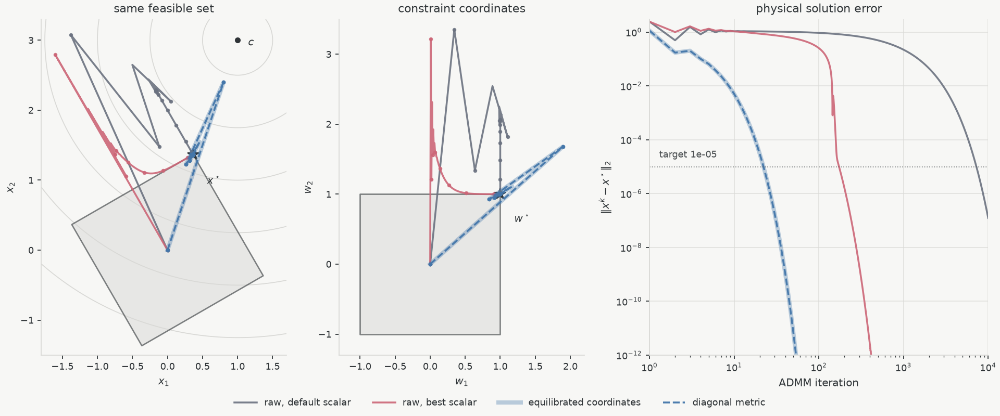

# splitQP



<p align="center"><sub><em>Two runs on the same quadratic program — same objective, same feasible set, same
optimum. All that differs is how the constraint rows are scaled, and ADMM needs 7256
iterations for one writing of it and 23 for the other. Difference is
preconditioning.</em></sub></p>

splitQP is a ~330-line JAX solver built around that, and around one other idea: you
only ever factor once. `Solver(P, A)` Choleskys $H = P + \sigma I + A^\top \mathrm{diag}(\rho) A$
at construction and reuses that single factor for every iteration, every
$(q, l, u)$, and every member of a batch. When the factorization is free, the metric
is what is left.

## quick start

[`Preconditioning.ipynb`](Preconditioning.ipynb) is with its output: iteration logs, assertions, the figure above. 
It solves a 24-member QP family off one factorization, then runs
the experiment above and prints the logs behind it.

[`pipg/PIPG.ipynb`](pipg/PIPG.ipynb), *Factorization or Feedback? From ADMM
to PIPG*, keeps this solver unchanged and asks when the reusable implicit solve
should instead be replaced by explicit proportional-integral primal-dual
feedback. It develops PIPGeq, general-cone PIPG, xPIPG, infeasibility signals,
and projection-preserving preconditioning as notebook-local JAX experiments.

Interestingly, customized PIPG has also been developed for real-time
onboard powered-descent guidance. [AIAA
2023-2003](https://doi.org/10.2514/6.2023-2003) embeds it within
sequential conic optimization for 6-DoF rocket landing, and the later
[study](https://arxiv.org/abs/2508.10439) reports the generated C
solver running on the NASA SPLICE Descent and Landing Computer in
hardware-in-the-loop tests. The companion
[Convexification](https://github.com/denglinc/Convexification) repository
explores the trajectory-optimization formulations behind this class of
structured convex subproblem.

To run it yourself you need Python 3.12 and [uv](https://docs.astral.sh/uv/):

```bash
uv run --group demo jupyter lab Preconditioning.ipynb
uv run --group demo jupyter lab pipg/PIPG.ipynb
```

CPU float64 is canonical; `uv sync --extra cuda` adds the optional CUDA backend.

## the solver

```math
\min_x \ \tfrac{1}{2}x^\top P x + q^\top x \quad\text{s.t.}\quad l \leq A x \leq u,
```

with $P \succeq 0$ and dense. A *family* keeps $P$ and $A$ fixed while $q$, $l$, $u$
vary — that is what the one factorization buys. Equalities ($l = u$), one-sided rows,
infinities, and empty constraint blocks all go through the same projection onto
$[l, u]$.

```python
import splitqp

solver = splitqp.Solver(P, A)               # the one factorization
metric = splitqp.Solver(P, A, rho=rho_m)    # a fixed diagonal penalty, shape (m,)
result = solver.solve(q, l, u)              # one QP
family = solver.solve_batch(qs, ls, us)     # B independent QPs sharing the factor
seq = solver.solve_sequence(qs, ls, us)     # an ordered warm family, one compiled program
warm = solver.solve(q2, l2, u2, init=result.state)

result.status         # "solved" | "max_iter" | "numerical_error" | "invalid_problem"
solver.factorizations # 1 after construction
```

`step` is one scalar ADMM update: `jax.vmap` maps it across a family, a compiled
`jax.lax.while_loop` drives it, and `solve_sequence` threads an ordered warm family
through one `jax.lax.scan`. All of it is in
[`src/splitqp/solver.py`](src/splitqp/solver.py).

## preconditioning

ADMM's $x$-update is exact: splitQP factors $P + \sigma I + A^\top\mathrm{diag}(\rho)A$
once and solves with it every iteration. What no factorization can fix is the ratio
between that curvature and the penalty each constraint row carries — and that ratio
is what sets the linear rate. You choose it when you choose how to write $A$.

The two-dimensional QP above is one feasible set written twice. In raw coordinates
its rows differ by two orders of magnitude, so the two penalty directions differ by
$10^4$, and no scalar $\rho$ suits both: the default takes 7256 iterations to reach
$\lVert x^k - x^\star\rVert_2 < 10^{-5}$, and the best of a 49-point grid still takes
174 — tuning moves the bottleneck from one row to the other instead of removing it.
Equilibrate the rows, or equivalently pass that same rescaling as the diagonal
penalty $\mathrm{diag}(0.01, 100)$, and it takes 23; the notebook checks that the two
runs trace the same trajectory to $7\times10^{-16}$, which is Boyd's point in §3.4.2
that a matrix penalty $\tfrac12 r^\top F^\top F r$ is ordinary ADMM after the change
of variables $r \mapsto Fr$.

Preconditioning is the choice of a coordinate system, or a metric, in which the
problem is isotropic; for a first-order method that choice is not a detail, it is
most of the cost. splitQP does not make it for you — it only lets you state it.

## limitation

- not OSQP: no automatic scaling or Ruiz equilibration, no adaptive $\rho$, no
  infeasibility certificate, no polishing, no sparse matrices, no autodiff, no custom
  GPU kernel;
- $\rho$, $P$ and $A$ are fixed at construction, and $\rho$ must match the problem
  scale — on an ill-conditioned family the default reaches `max_iter`;
- the penalty is diagonal on purpose: a full SPD $R$ would make the box projection
  non-separable, and the coordinate-wise clip is why the iteration is cheap;
- non-finite iterates come back as `numerical_error` and invalid or non-convex data
  as `invalid_problem`; neither is ever reported as a solve.

`bench.py` times this against OSQP and ProxQP locally
(`uv run --group bench python bench.py`) — an experiment, not a solver ranking.

## references

- [Boyd et al., *Distributed Optimization and Statistical Learning via the
  Alternating Direction Method of Multipliers*](https://web.stanford.edu/~boyd/papers/pdf/admm_distr_stats.pdf)
  for the ADMM state, residual interpretation, stopping tests, warm starts, and
  §3.4.2's general augmenting term, which is the diagonal penalty here.
- [Stellato et al., *OSQP: an Operator Splitting Solver for Quadratic
  Programs*](https://arxiv.org/abs/1711.08013) for the box form, proximal term,
  relaxation, factor reuse, and §5's data scaling and diagonal penalty selection.
- [Bishop et al., *ReLU-QP*](https://arxiv.org/abs/2311.18056) for the fixed-point
  and batched reading of this iteration.
- [JAX](https://docs.jax.dev/) and [JAXopt's BoxOSQP](https://github.com/google/jaxopt)
  for the transform and factor/solve patterns.
- [qpbenchmark](https://github.com/qpsolvers/qpbenchmark) if you want a real solver
  benchmark.

## sibling

[barrierQP](https://github.com/denglinc/barrierQP) is the same problem class from the
other direction — a Mehrotra predictor–corrector interior-point method, where the one
factorization is a KKT matrix per iteration and the corrector reuses it as a second
right-hand side.
